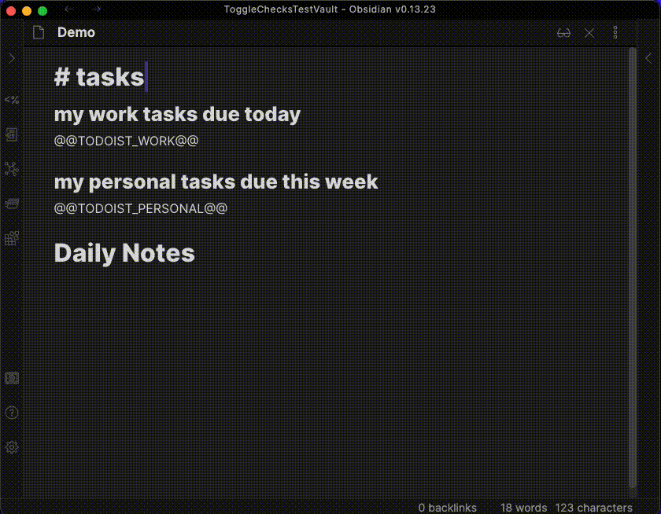

# Todoist Text - Obsidian Plugin

This obsidian plugin integrates your Todoist tasks with markdown checkboxes in a text-centric approach.

Demo: 

# Usage
1. Ensure you understand the security implications (see Security section of this file)
2. Install this plugin (Todoist Text) through Obsidian and enable it
3. Enter your Todoist API token in the plugin settings, as explained there
4. Read below sections to learn how to manipulate tasks

## Automatic creation of task list
Executing the command "Todoist Text: Replace keyword with todos" will search the currently open file and replace your keyword (configurable in the settings) with your todos from Todoist. The keyword will use your chosen [filter definition](https://todoist.com/help/articles/introduction-to-filters), which allows you to control exactly what tasks will be shown.

You can configure multiple keywords, each corresponding to a separate Todoist filter definition.

You can enable automatic replacement of the keyword with todos in the settings, so you won't have to manually run the "Todoist Text: Replace keyword with todos" command.

If you want to use a template file (e.g. for Daily Notes) and you have automatic replacement of your keyword enabled, you will find that your template file itself would have its keyword get replaced with todos. To prevent this, you can add your template folder to the "Excluded Folders" in the settings. Then, you can just place your keyword in the template file, and the files that it generates should automatically replace the keyword with your todos.

## Marking tasks as complete and re-opening
When your cursor is on the line of a Todo created by this plugin, executing the command "Todoist Text: Toggle todoist task" will complete that task on Todoist and check off the task on your local file.

You will likely want to use the `<Cmd>-<Enter>` hot key to check off tasks. To do this, go to the Settings -> Hotkeys. Find the command "Todoist Text: Toggle todoist task", and set the hot key as desired. If you set the hot key to `<Cmd>-<Enter>`, be sure to remove `<Cmd>-<Enter>` from its default ("Toggle Checklist Status"). 

You can use the "Todoist Text: Toggle todoist task" command/hot key for any check list item, even if it is unrelated to Todoist. Under the hood, the command will check the suffix of the checklist item, and if it contains a Todoist URL, it will update that todo on Todoist. If it does not end with a Todoist URL, it will simply check/uncheck the line locally.

Clicking a checklist box with the mouse is currently not supported.

## Adding/updating tasks
This plugin currently does not support adding tasks to Todoist. Until then, I recommend using the Todoist desktop app - it has a global shortcut that can quickly add a task from anywhere on your computer.

This plugin does not automatically update your local files based on remote changes to Todoist tasks. This may be supported later, please reach out via a GitHub issue if this would be useful to you.

## Security 
This plugin stores your Todoist API token in plain text in your .obsidian/plugins folder. Anyone with your Todoist API token could access and manipulate all of your Todoist data. Ensure that you are not syncing/sharing your .obsidian/plugins folder for security purposes. Use this plugin at your own risk.

## Feature requests
Please reach out (by filing a GitHub issue) if you'd like to discuss possible new features or need help with anything! If you do see a GitHub issue that already exists, feel free to comment on it, which could raise the priority/help inform how the feature is implemented.

See the [changelog](CHANGELOG.md) for recent changes.

I'm actively creating new features, so be sure to "watch" this repository (with the GitHub button near the top of the screen) to get notified so that you'll know when to update.

## Attribution
I copied the 'folder suggest' settings feature from https://github.com/liamcain/obsidian-periodic-notes - thanks!
